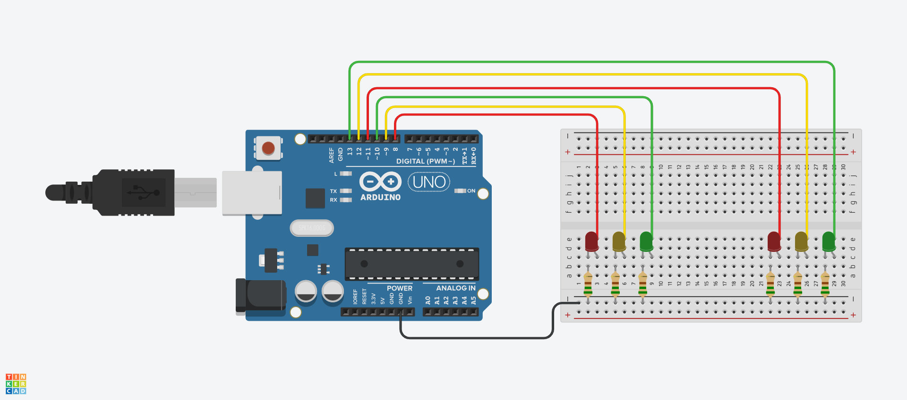

# 🚦 Projeto de Semáforo com Arduino

Este repositório contém um projeto de simulação de dois semáforos utilizando uma placa Arduino UNO. O objetivo é demonstrar o funcionamento de um sistema de controle de tráfego, alternando os sinais luminosos entre dois sentidos de um cruzamento.

## 🔌 Diagrama do Circuito


## Sobre o Projeto

O projeto implementa a lógica básica de controle de semáforos. São utilizados dois conjuntos de LEDs (vermelho, amarelo e verde) para representar cada semáforo. O código faz a alternância dos sinais de forma sincronizada, permitindo a passagem de veículos em um sentido por vez, tal como ocorre em cruzamentos reais.

O funcionamento do sistema é alternado e obedece a seguinte sequência:

1. **Semáforo 1 verde, Semáforo 2 vermelho:** Permite passagem em um sentido enquanto o outro está fechado.
2. **Semáforo 1 verde, Semáforo 2 amarelo:** Alerta para troca iminente de sinal no sentido que estava fechado.
3. **Semáforo 1 vermelho, Semáforo 2 verde:** Inverte o sentido de passagem.
4. **Semáforo 1 vermelho, Semáforo 2 amarelo:** Alerta para troca iminente de sinal no novo sentido.

O tempo em que cada sinal permanece aceso pode ser ajustado no código, permitindo simular diferentes tempos de ciclo de semáforo.

## 📋 Lista de Materiais

| Quantidade | Componente         |
|------------|--------------------|
| 1          | Arduino Uno        |    
| 2          | LED Vermelho       |
| 2          | LED Amarelo        |
| 2          | LED Verde          |
| 6          | Resistor           |
| 1          | Protoboard         |
| 15         | Jumpers (Fios coloridos)      |

## 🔌 Esquema de Fiação
| Arduino | Componente        |
|---------|-------------------|
| Pino 8  | LED Verde S1      |
| Pino 9  | LED Amarelo S1    |
| Pino 10 | LED Vermelho S1   |
| Pino 11 | LED Verde S2      |
| Pino 12 | LED Amarelo S2    |
| Pino 13 | LED Vermelho S2   |

> **Importante:** Todos os LEDs usam um resistores de 220Ω.

## ⚙️ Funcionamento
Ciclo completo (15 segundos):
1. **Fase 1 (5s):**  
   - S1: Verde  
   - S2: Vermelho

2. **Fase 2 (2.5s):**  
   - S1: Verde  
   - S2: Amarelo

3. **Fase 3 (5s):**  
   - S1: Vermelho  
   - S2: Verde

4. **Fase 4 (2.5s):**  
   - S1: Amarelo  
   - S2: Verde

## 💻 Código

```arduino
void loop() {
  // S1 Verde + S2 Vermelho (5s)
  digitalWrite(semaforo1Verde, HIGH);
  digitalWrite(semaforo2Vermelho, HIGH);
  delay(5000);

  // S1 Verde + S2 Amarelo (2.5s)
  digitalWrite(semaforo2Vermelho, LOW);
  digitalWrite(semaforo2Amarelo, HIGH);
  delay(2500);
  
  // ... (ciclo continua)
}
```
Acesse o código completo aqui: [Código completo](Semaforo_Arduino.ino)

## 🚀 Melhorias Futuras
- Adicionar botão para pedestres
- Incluir display de contagem regressiva

---